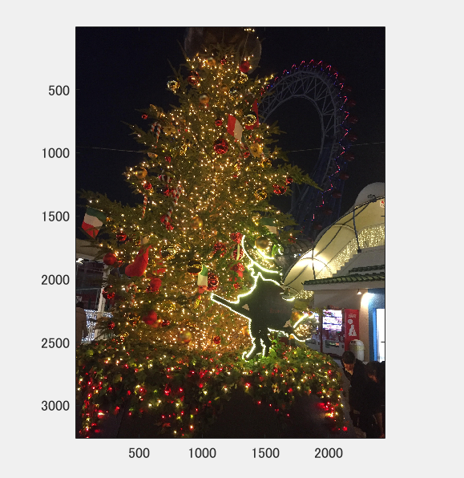
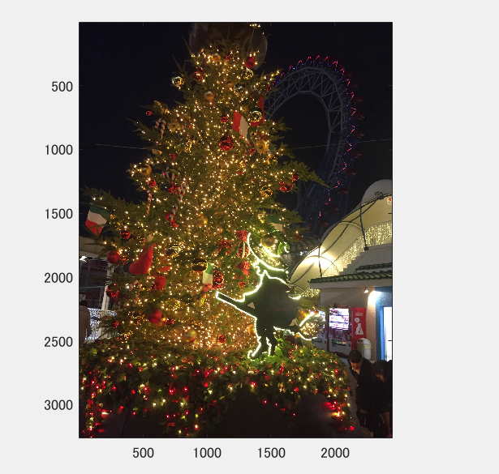
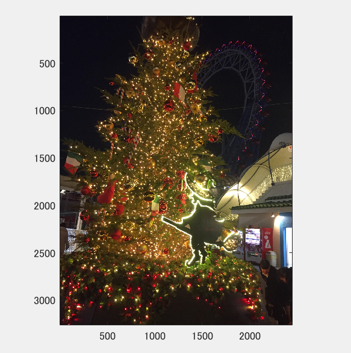
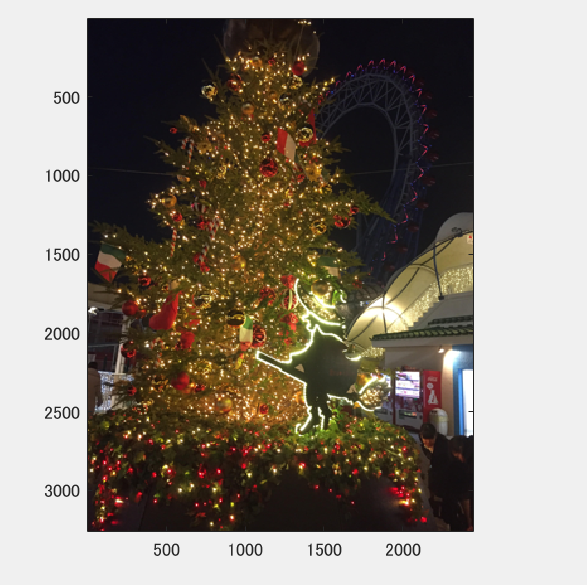
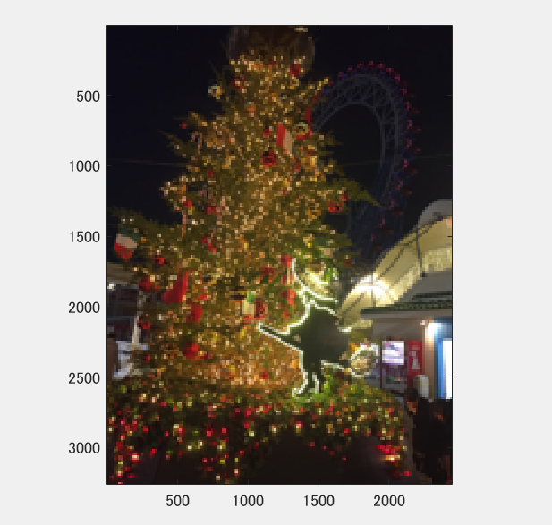
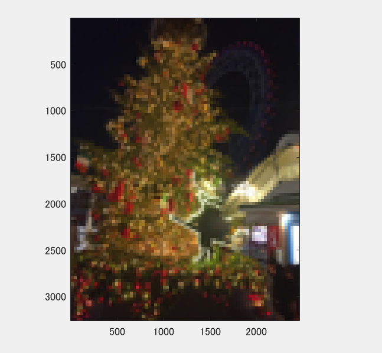

課題1
====

## 概要

「christmas tree.jpg」を原画像とする．この画像は自分の携帯で撮影した画像である。

課題１では原画像を1/2サンプリング、1/4サンプリングとサンプリング幅を大きくしていった。

## 使用した画像

## 結果

図１　1段階目

図２  2段階目

図3　 3段階目

図4 　 4段階目

図5　5段階目

## プログラムのソース

[kadai1.m](https://github.com/Minami0o0/image_processing/blob/master/lecture_image_processing-master/kadai1.m)

## 考察
1段階目から２段階目でのサンプリングではあまり変化が見られないが３段階目から５段階目とサンプリング幅が大きくなっていくとモザイク状のサンプリング歪みが発生することが確認できた。
