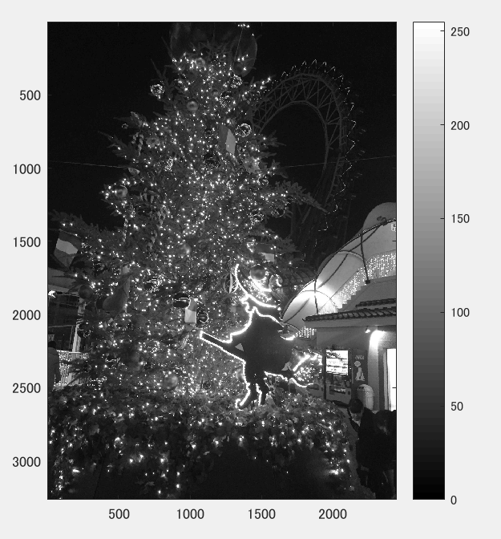
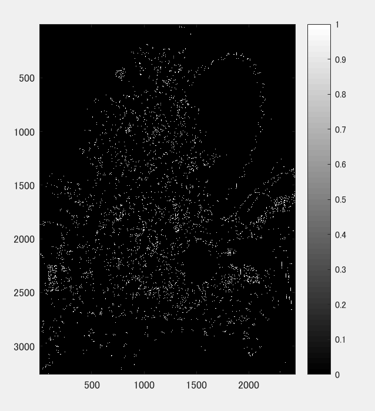
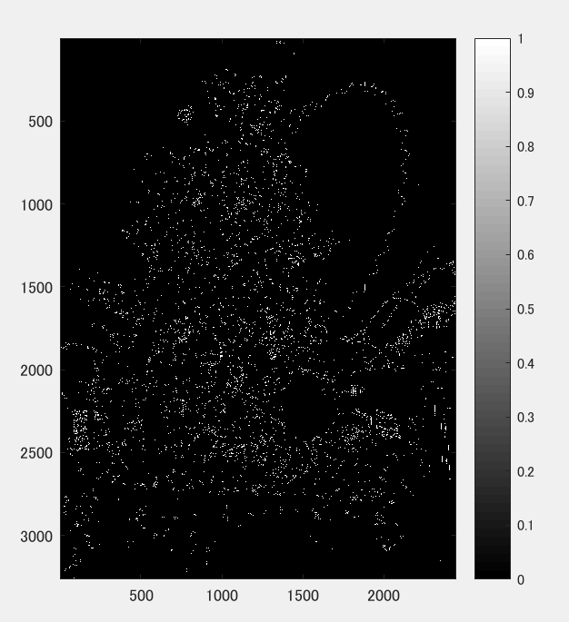
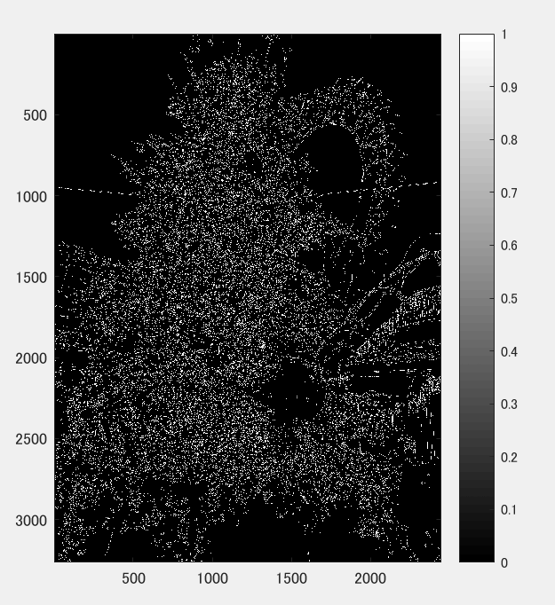

課題10
====

## 概要

本稿では、輪郭を様々な方法で抽出した。

## 使用した画像

## 結果

図１　白黒濃淡

図２ プレウィット法でのエッジ抽出

図３ ソベル法でのエッジ抽出

図４　キャニー法でのエッジ抽出

## プログラムのソース

[kadai10.m](https://github.com/Minami0o0/image_processing/blob/master/lecture_image_processing-master/kadai10.m)

## 考察

　原画像がエッジを出すものに適切ではなかったせいか輪郭のようにエッジを出すことができなかった。プレウィット法よりソベル法、ソベル法よりキャニー法のほうがエッジが濃く出ていた。
