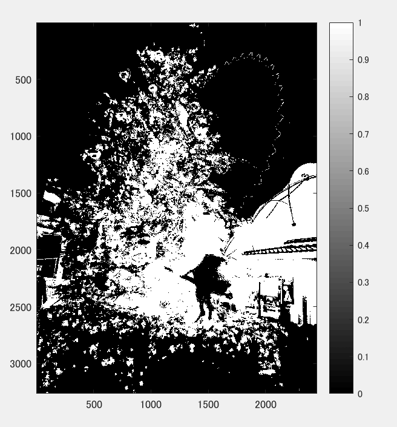

課題３
====

## 概要

本稿では、ダイナミックレンジをMATLABを用いて変更した。

## 使用した画像

## 結果

図１　白黒濃淡

図２ 64

図3　96

図4 128

図5　192

## プログラムのソース

[kadai3.m](https://github.com/Minami0o0/image_processing/blob/master/lecture_image_processing-master/kadai3.m)

## 考察
白黒濃淡では原画像が白黒になっただけであるため周りに何があるのかが見て取れるがダイナミックレンジを変更すると魔女のモニュメントや建物が明るくなりすぎたり、ツリーが暗くなりすぎて何かわからなくなってしまった。
