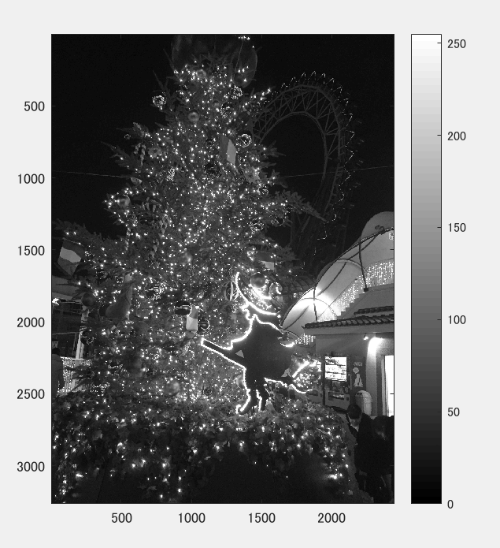
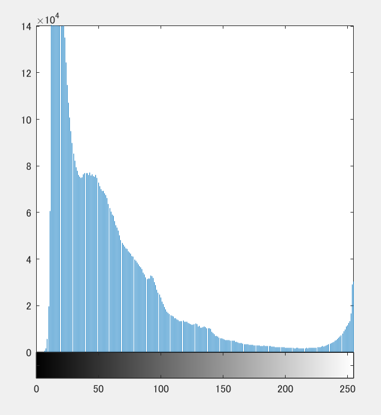

課題4
====

## 概要

本稿では、ダイナミックレンジをMATLABを用いて変更した。

## 使用した画像

## 結果

図１　白黒濃淡

図２

neko.pngの輝度値ヒストグラムが表示された。

## プログラムのソース

[kadai4.m](https://github.com/Minami0o0/image_processing/blob/master/lecture_image_processing-master/kadai4.m)

## 考察
christmas tree.jpgでは撮影を夜に行っているため暗い部分が多く、ヒストグラムも輝度の低い数値に濃度値が集中した。
しかし、ライトアップで光の要素もあったことから、ヒストグラムも輝度が255のあたりでまた上昇している。
