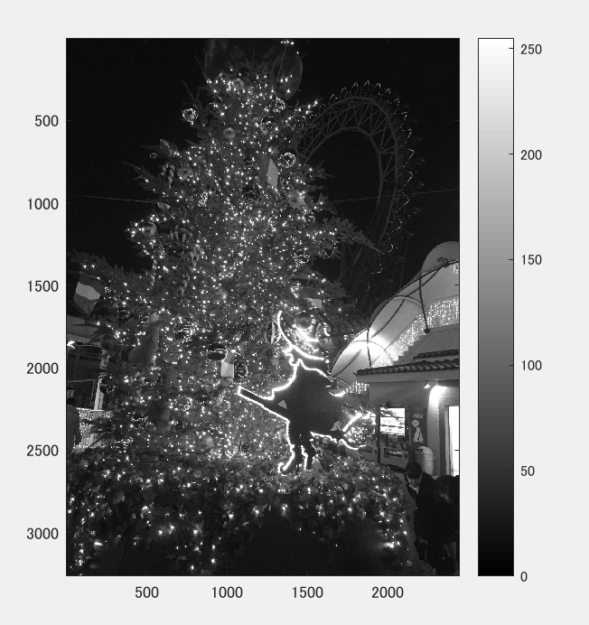
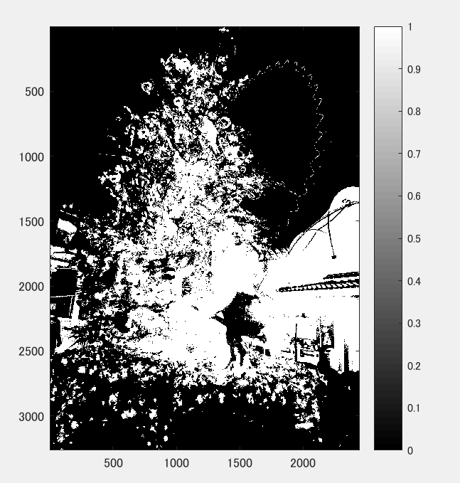

課題5
====

## 概要

本稿では、判別分析法を用いて画像二値化した．

## 使用した画像

## 結果

図１　白黒濃淡

図２

輪郭が分かるように2値化されている。

## プログラムのソース

[kadai5.m](https://github.com/Minami0o0/image_processing/blob/master/lecture_image_processing-master/kadai5.m)

## 考察

画像から分離度を算出し、自動的に閾値を決定して二値化処理を行う手法である。このchristmas tree.jpgの原画像では輪郭かどうかが分かりにくかった。

この手法は、多くの画像処理ソフトやOpenCVにも実装されている。
