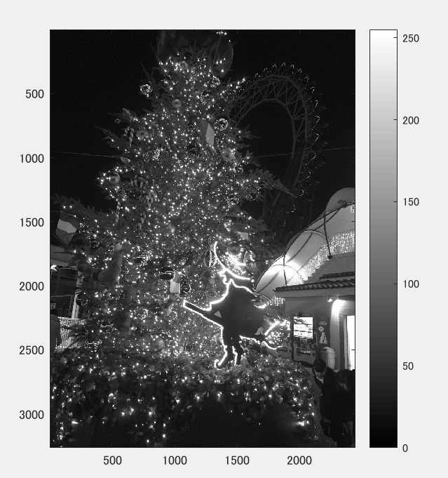
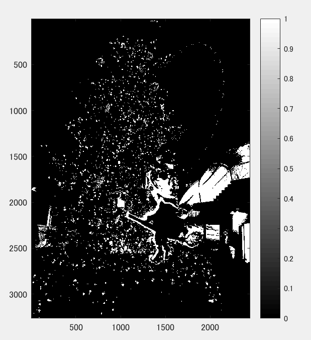
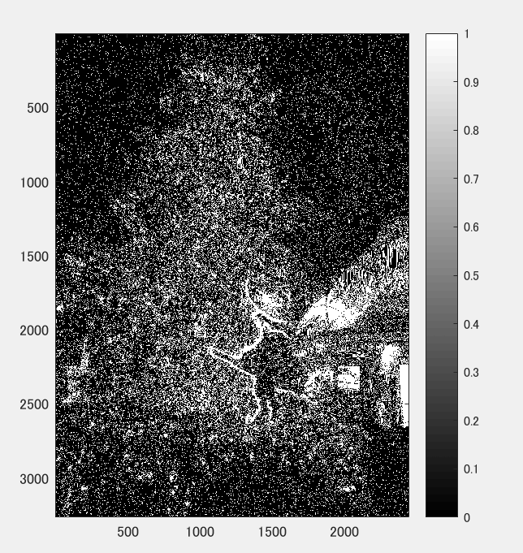

課題6
====

## 概要

下記のプログラムを参考にして画像を二値化した．

課題作成にあたっては「Lenna」以外の画像を用いよ．

## 使用した画像

## 生成された画像

白黒濃淡画像にしたもの

濃度値＝128で2値化

ディザ法で2値化

## プログラムのソース

[kadai6.m](https://github.com/Minami0o0/image_processing/blob/master/lecture_image_processing-master/kadai6.m)

## 考察

濃度値128の場合、128以下のも濃度のものがすべて"0"となっていることがわかった。

一方ディザ法の場合は、上記の場合と比較して白く表示されるとことが多くなり今回の画像では見づらくなった。
