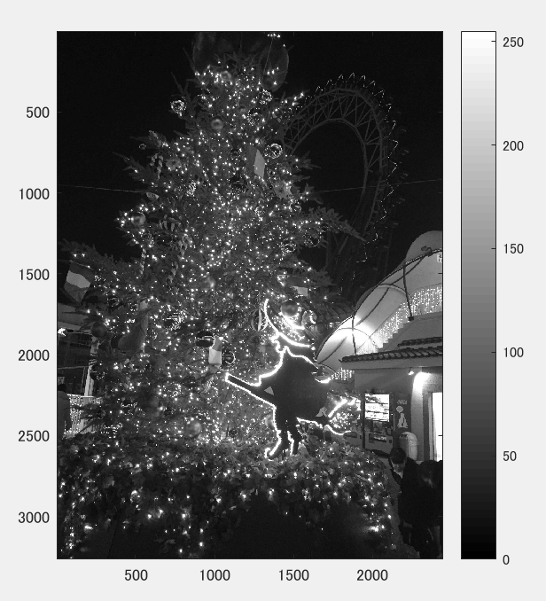
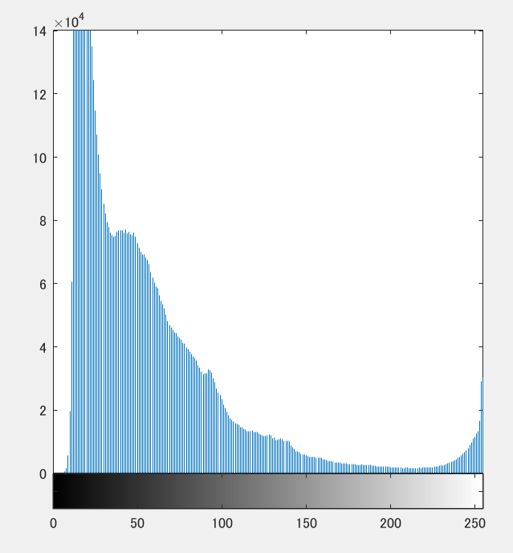
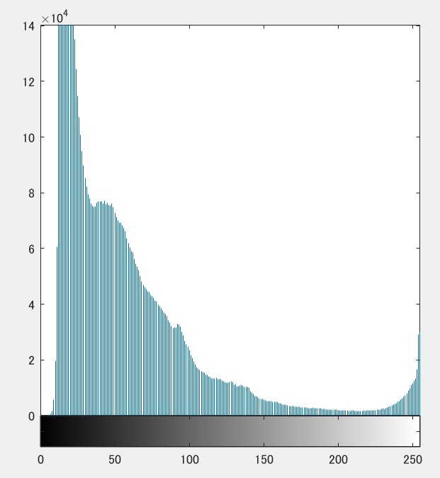

課題7
====

## 概要

ダイナミックレンジの拡大を行った。

画素のダイナミックレンジを０から２５５にした。

## 使用した画像

## 生成された画像

 図１　白黒濃淡画像にしたもの

 図２　濃度ヒストグラムの作成

 図３　ダイナミックレンジの拡大

 図４　ダイナミックレンジの拡大後の濃度ヒストグラム

## プログラムのソース

[kadai7.m](https://github.com/Minami0o0/image_processing/blob/master/lecture_image_processing-master/kadai7.m)

## 考察

　プログラムの実行はできたがいまいち画像でダイナミックレンジの拡大を感じることができなかった。
