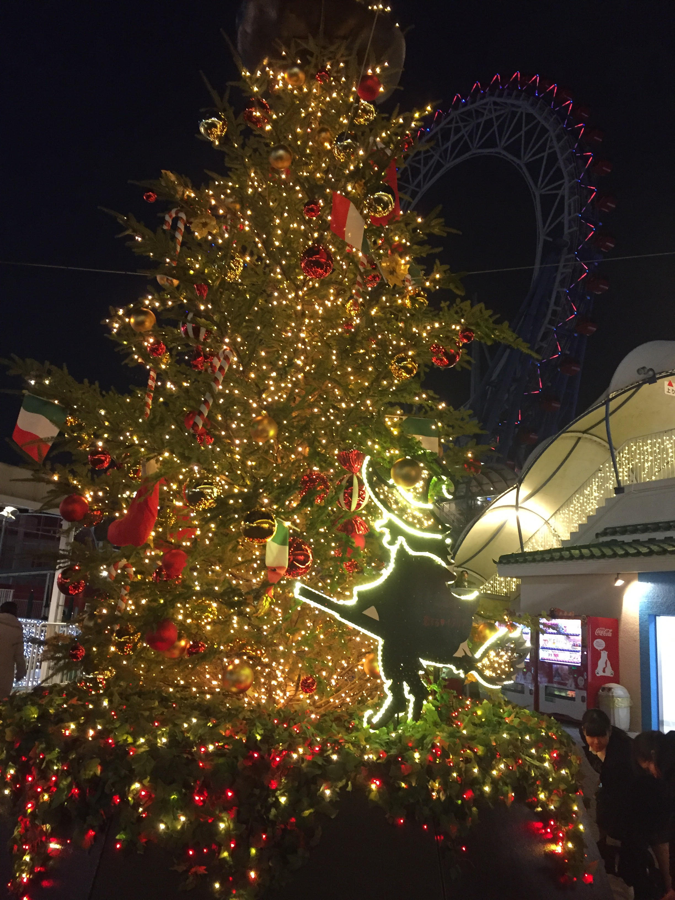

課題8
====
## 概要

本稿では、画像を２値化し、ラベリングを行った。

## 使用した画像

## 結果

図１　白黒濃淡

図２

128で二値化

図３　

## プログラムのソース

[kadai8.m](https://github.com/Minami0o0/image_processing/blob/master/lecture_image_processing-master/kadai8.m)

## 考察

　２値画像には、連結している複数の領域がある。これらを区別するためにそれぞれの領域にラベルを付ける。このことをラベリングと言い図３では色によってラベルの区別がされていると考える。
