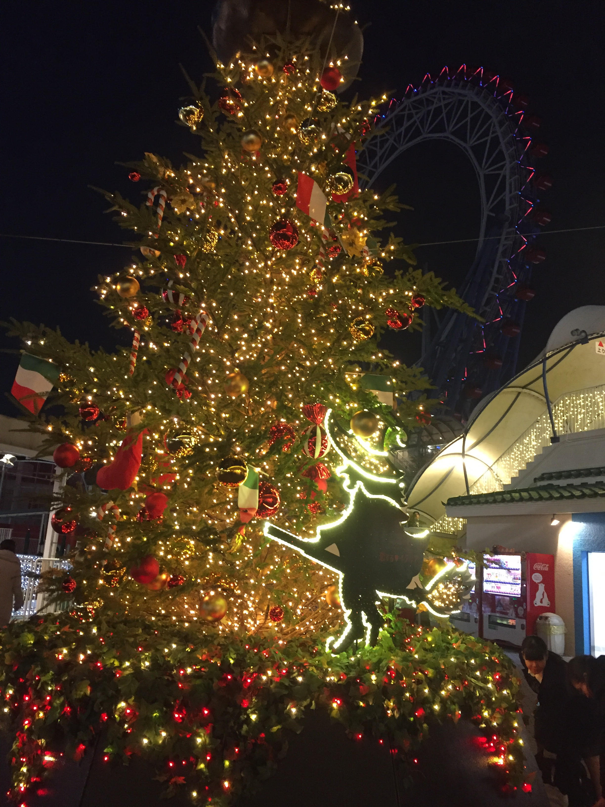
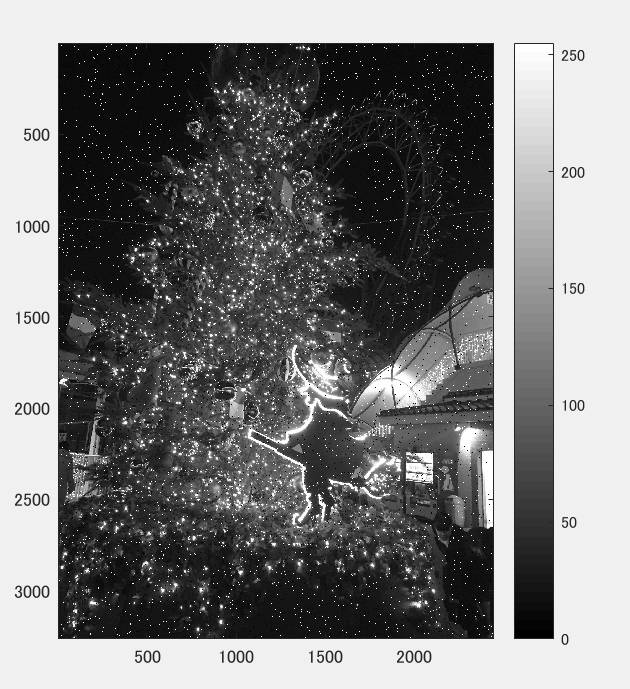
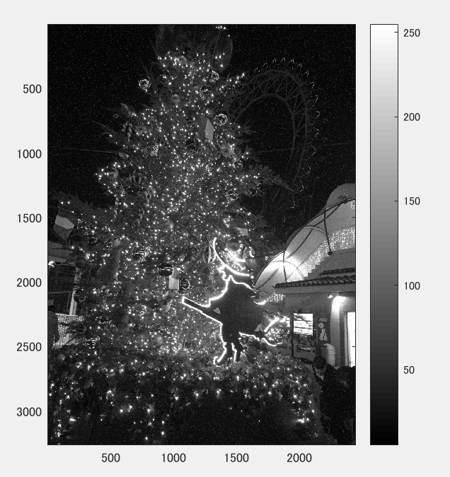
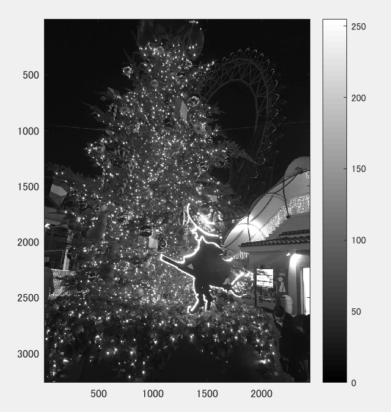
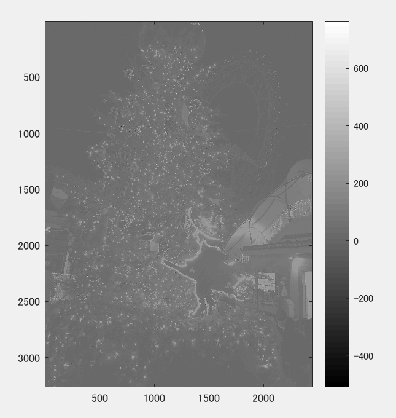

課題９
====

## 概要

本稿では、メディアンフィルター、平滑化フィルタを適用し，ノイズ除去を体験した。

## 使用した画像

## 結果

図１　白黒濃淡

図２ ノイズ添付

図３ 平滑化フィルタを用いて雑音除去

　ノイズが除去されていることがわかる。

図４　メディアンフィルタを用いて雑音除去

　より原画像に近くノイズが除去されていることがわかる。

図5　任意のフィルター適用

　ノイズはなくなっているが全体的に曇りがかっているように見える。

## プログラムのソース

[kadai9.m](https://github.com/Minami0o0/image_processing/blob/master/lecture_image_processing-master/kadai9.m)

## 考察

移動平均フィルターは各画素の値を、周辺画素の平均値に置き換える処理である。この処理をすると、全体的にエッジがなまった画像が生成される。メディアンフィルターは、各画素の値を周辺画素の中央値に置き換える処理である。この処理は、移動平均フィルターと比べて入力画像のエッジを損なわない画像が得られる。

どちらのフィルターでもきれいにノイズ除去ができていた。
